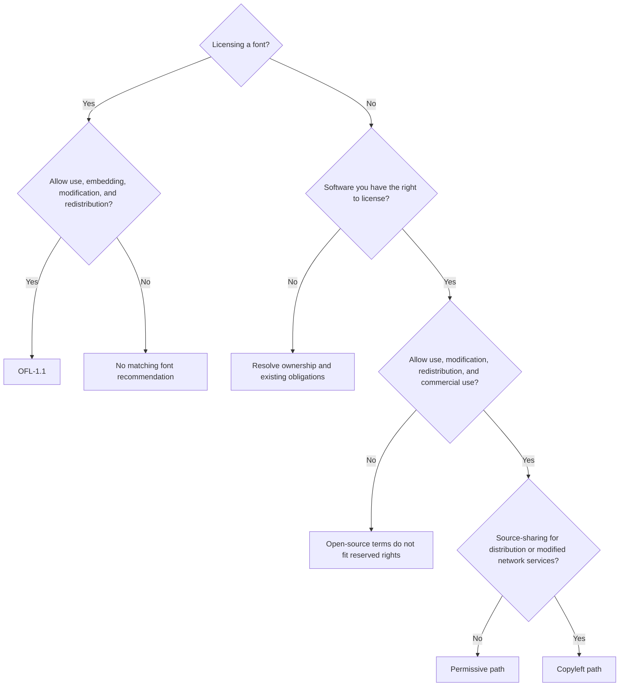
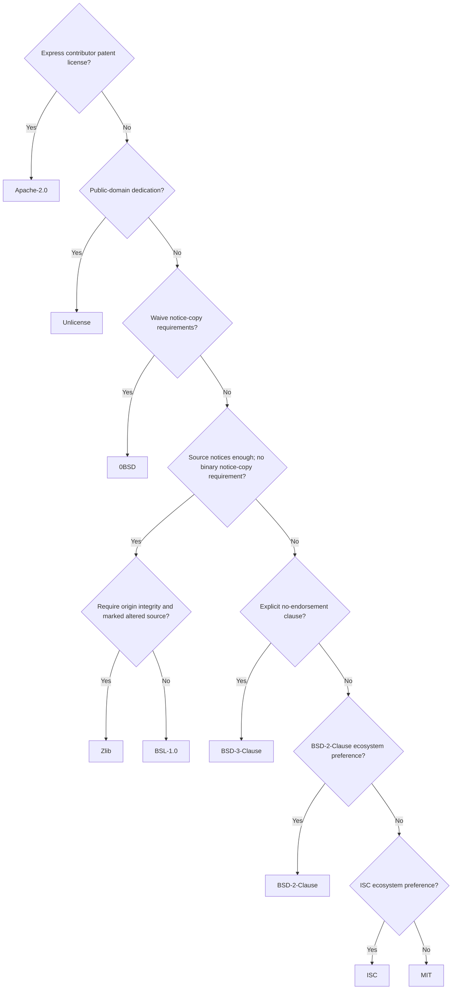
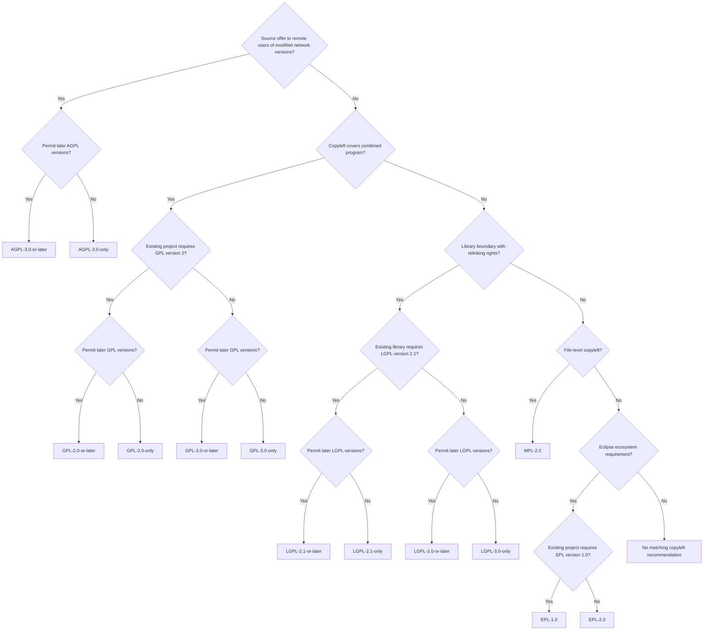

# Decision tree

The CLI's tree is obligation-driven rather than a ranking of licenses from “simple” to “strong.” Its recommendations and `--compat` share the canonical SPDX catalog in `src/licenses.zig`. All 23 licenses and four advisory outcomes have explicit preference-path coverage in `src/tree_test.zig`.

## Entry and scope

OFL fonts keep their own terms, including Reserved Font Names and the restriction on selling fonts by themselves. Documents made with those fonts do not inherit OFL. The software path assumes you have licensing rights; existing component licenses cannot be replaced just by choosing a new project license. Documentation and other non-font assets are outside this tree.

## Permissive path

The patent question precedes all permissive recommendations. Apache adds express patent grants, change notices, and applicable NOTICE attributions. MIT, BSD, and ISC preserve notices rather than eliminating conditions. `0BSD` retains copyright without a notice-copy requirement; `Unlicense` attempts a public-domain dedication. Boost's binary exemption differs from Zlib's altered-source/origin rules. `BSL-1.0` means **Boost**, not the Business Source License.

## Copyleft path

GPL covers covered combined programs, LGPL provides library-level permissions with source/relinking conditions, and MPL keeps covered files under its terms while separate files may differ. EPL is selected for an explicit ecosystem requirement, not vague “business-friendly” preferences.

Ordinary copyleft distribution obligations do not require publishing every private modification. AGPL adds a source offer to remote users of a modified network version. Existing projects must already grant any selected later-version permission, or you must own the rights to grant it. LGPL-2.1's GPL conversion option is not permission to upgrade an LGPL-2.1-only library to LGPL-3.0.

## Compatibility is a separate assessment

A recommendation describes suitable terms for work you can license. `--compat` instead considers **all existing licenses** and distinguishes ordinary compliance from conditions requiring separate libraries/files, font bundling, GNU module combinations, or secondary-license grants. Pairwise checks search for a common target; they are not symmetric relicensing permissions.

In particular, GPL-2.0-only and GPL-3.0 cannot be freely combined, while GPL-2.0-or-later permits selecting version 3. GPL/AGPL version-3 combinations retain separate module licenses under section 13. MPL secondary licensing depends on eligibility and an actual larger work with secondary-licensed material. EPL secondary licensing needs the initial contributor's specific Exhibit A notice; including the template license text does not supply that grant.

## Authoritative references

- [GNU license compatibility list](https://www.gnu.org/licenses/license-list.html) and [GNU compatibility matrix](https://www.gnu.org/licenses/gpl-faq.html#AllCompatibility).
- [LGPL-2.1 section 3: GPL conversion](https://www.gnu.org/licenses/old-licenses/lgpl-2.1.html) and [GPL-3.0 section 13: AGPL combinations](https://spdx.org/licenses/GPL-3.0-only.html).
- [MPL-2.0 section 3.3](https://spdx.org/licenses/MPL-2.0.html) and [Mozilla's MPL FAQ](https://www.mozilla.org/en-US/MPL/2.0/FAQ/).
- [EPL-2.0 section 3.2 and Exhibit A](https://spdx.org/licenses/EPL-2.0.html).
- [Boost Software License](https://www.boost.org/LICENSE_1_0.txt), [Zlib](https://spdx.org/licenses/Zlib.html), and [official OFL text](https://openfontlicense.org/open-font-license-official-text/).

This is general guidance, not legal advice. Review the applicable license texts, notices, and how your code is combined.
